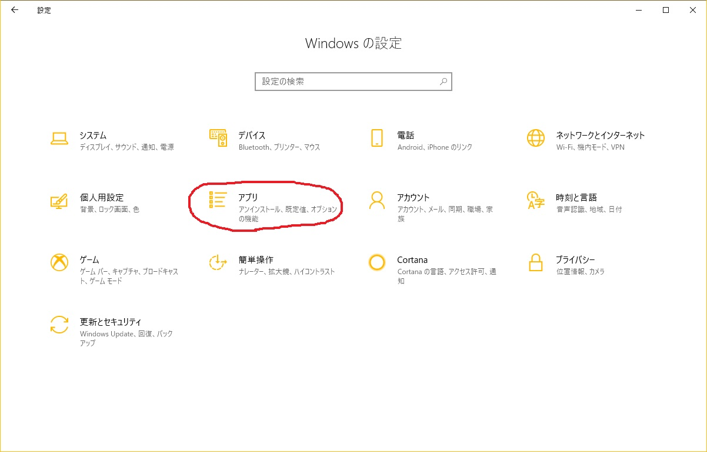

# WSLを導入する

Windows 10を使用している方でも，気軽にLinux環境を整える手段の1つとして，Windows Subsystem for Linux（WSL）というものがあります。  
ここでは，WSLの導入方法について記述します。

## Windows 10の機能の有効化（2019/3/28 現在）

WSLはWindows 10の機能の1つとなっています。  
まずは，WSLを有効にしましょう。

Windowsの設定のホーム画面は次のようになっています。  
アプリを選択してください。

アプリを選択すると，次のような画面が出てきます。  
右側のプログラムと機能を選択してください。

プログラムと機能を選択すると，次のような画面が出てきます。  
左側のWindowsの機能の有効化または無効化を選択してください。

プログラムと機能を選択すると，次のような画面が出てきます。  
下にスクロールしていき，Windows Subsysytem for Linuxのチェックボックスをオンにしてください。

## WSLの導入

WSLは現在，Microsoft Storeから導入することができます。  
Ubuntu18.04を使用する場合は，埼玉大学の後藤先生のページを参考にして進めていってください。

[Ubuntu 18.04のWSL上へのインストールと初期設定](http://www.aise.ics.saitama-u.ac.jp/~gotoh/HowToInstallUbuntu1804OnWSL.html)

Ubuntu以外を使用したい！という方は，検索画面で「WSL」と入力すれば，他のOSも表示されます。  
2019/3/28現在では5種類のOSを選択できるようですね。  
