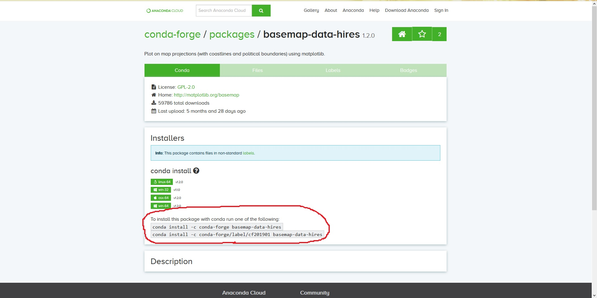

# Pythonを導入する

まず，Pythonを扱うために，Pythonの導入をしてみましょう。  
気象データを扱うためには，Pythonのライブラリの都合上，LinuxあるいはMacの環境下にあることが望ましいです。  
Windowsを使用している方も，Windows 10であれば，Windows Subsystem for Linux（WSL）を導入することで，Linuxの環境下でPythonを使用することができます。  
WSLの導入方法については，[こちら](WSL-install.md)を参照してみてください。

## Minicondaを用いたPythonの導入

Pythonの導入方法は色々あるのですが，今回私がおすすめするPythonの導入方法は，Minicondaを使用した方法です。  
ここでは，WSLも含め，LinuxあるいはMacの環境下にある前提で進めていきます。

まず，任意のディレクトリ（ここでは~/Downloads）にMinicondaのスクリプトファイルをダウンロードする。

```
$ mkdir ~/Downloads ←　ディレクトリ未作成の場合
$ cd ~/Downloads
$ wget https://repo.anaconda.com/miniconda/Miniconda3-latest-Linux-x86_64.sh
```

次に，そのディレクトリ内で，

```
$ chmod 755 ./Miniconda3-latest-Linux-x86_64.sh
$ ./Miniconda3-latest-Linux-x86_64.sh
```

と実行すると，最初につらつらと同意の為の確認文書が出てきます。  
Enterを押し続けると，

```
Do you accept the license terms? [yes|no]
```

と出てきますので，yesと入力してください。

次にインストール場所の選択を聞かれます。  
基本的にホームディレクトリの下にMiniconda3というディレクトリが作成されて，その下にPythonの環境が構築されます。  
ホームディレクトリ以外で作成したい場合は，

```
Miniconda3 will now be installed into this location:
```

と出てくる場面で，ディレクトリの場所を絶対パスで指定してください。

最後にパスを追加するか聞かれます。  
yesを選択しても構いません。  
しかし，~/Miniconda3/binにパスを通してしまったが為にPython以外の場面で不具合が生じる可能性がありますので，この場面ではnoを選択し，インストール終了後に~/.bash_aliasesを作成して，

```
alias python=$HOME/Miniconda3/bin/python3
alias conda=$HOME/Miniconda3/bin/conda
alias jupyter=$HOME/Miniconda3/bin/jupyter
```

と記述して，~/.bash_profileや~/.bashrcと同様に

```
$ source ~/.bash_aliases
```

とすることをお勧めします。

## ライブラリのインストール方法

ライブラリのインストールは，condaコマンドを使用する方法をおすすめします。  

1つのライブラリをインストールするには，例えばnumpyでは，  

```
$ conda install numpy
```

とすれば，インストールできます。

複数のライブラリをインストールするには，aptコマンドと同様，後ろに続けて記述するだけで大丈夫です。

```
$ conda install -c conda-forge scipy pandas matplotlib basemap-data-hires
```

ここで，"-c conda-forge"は，conda-forgeというチャンネルを通じてライブラリをインストールする，ということです。  
ライブラリによっては，特定のチャンネルを通じてのみインストールできるものがあります。  
basemap-data-hiresはその1つです。

不足しているライブラリをインストールする時，  
"conda パッケージ名"  
で検索してみてください。  
すると，basemap-data-hiresでは，次のようなページ次のようなページにアクセスすることができます。



注目すべきは赤丸部分です。  
ここに記述されているコードのどれか1行を選び，記述通り実行すれば，基本的にはライブラリをインストールすることができます。（ライブラリの依存関係で不可能な場合もあります）  
複数行ある場合は，"conda-forge"のチャンネルを使用することをおすすめします。

まとめると，不足しているライブラリがある場合は，"conda パッケージ名"で検索し，  
"To install this package with conda run one of the following:"  
の部分に記述されているコードを実行です。